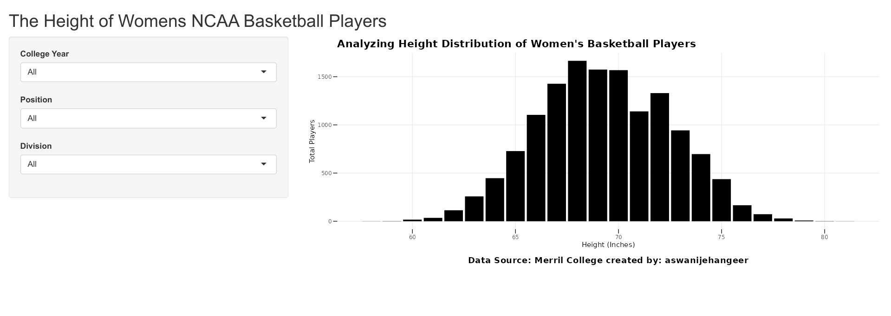
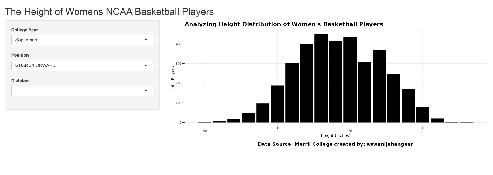

# Shiny App: Exploring Height Distribution of Women's Basketball Players

This Shiny app allows you to explore and analyze the height distribution among women's basketball players in the NCAA.

## File Structure

- `global.R`: R script containing shared global functions and variables.
- `shinyapp.R`: R script containing the Shiny app code.
- `wbb_rosters_cleaned_2022_23.csv`: CSV file containing the dataset used for analysis.
- `images/`: Folder containing screenshots app.

#### Data Source: [Philip Merrill College of Journalism at the University of Maryland](https://github.com/Sports-Roster-Data/womens-college-basketball).

